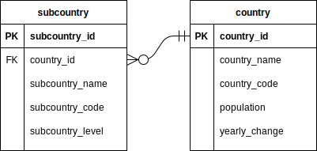
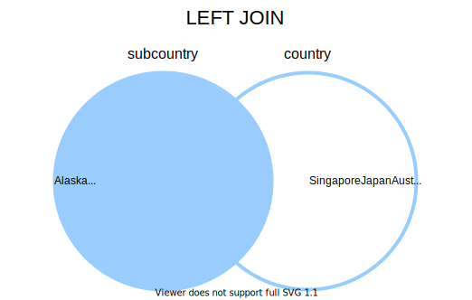
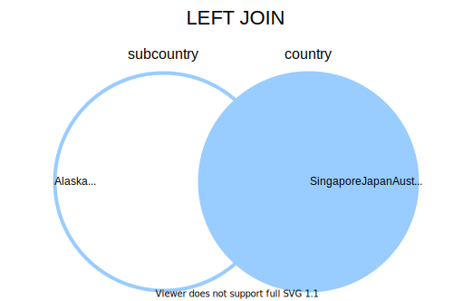
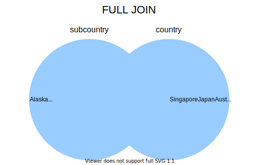
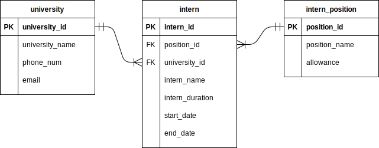

# Creating Database & SQL Querying
This hands-on guide will teach you how to create a new database and perform SQL querying.

- [Creating Database & SQL Querying](#creating-database--sql-querying)
  - [PostgreSQL & psql](#postgresql--psql)
    - [1.0 Creating database using psql](#10-creating-database-using-psql)
      - [1.1: Run psql](#11-run-psql)
      - [1.2: Create a database](#12-create-a-database)
      - [1.3: List available databases](#13-list-available-databases)
      - [1.4: Switch database connection](#14-switch-database-connection)
      - [1.5: Reconnect database](#15-reconnect-database)
    - [2.0 Creating table in SQL](#20-creating-table-in-sql)
      - [2.1: Run SQL Statement in psql](#21-run-sql-statement-in-psql)
      - [2.2: Edit SQL statement](#22-edit-sql-statement)
      - [2.3: List available tables](#23-list-available-tables)
  - [SQL Querying](#sql-querying)
    - [1.0 `CREATE TABLE`](#10-create-table)
    - [2.0 `INSERT`](#20-insert)
    - [3.0 `SELECT`](#30-select)
    - [4.0 `UPDATE`](#40-update)
    - [5.0 `DELETE`](#50-delete)
    - [6.0 `JOIN`](#60-join)
      - [6.1 `INNER JOIN`](#61-inner-join)
      - [6.2 `LEFT JOIN`](#62-left-join)
      - [6.3 `RIGHT JOIN`](#63-right-join)
      - [6.3 `FULL JOIN`](#63-full-join)
    - [7.0 `DROP`](#70-drop)
  - [Exercises](#exercises)
    - [1.0 Create database](#10-create-database)
    - [2.0 Create table](#20-create-table)
    - [3.0 Import CSV data](#30-import-csv-data)
    - [4.0 Insert data](#40-insert-data)
    - [5.0 Update data](#50-update-data)
    - [6.0 Remove data](#60-remove-data)
    - [7.0 Join table](#70-join-table)
    - [8.0 Export CSV data](#80-export-csv-data)
  - [Summary](#summary)
  - [Contributors](#contributors)
  - [Reference](#reference)

## PostgreSQL & psql
### 1.0 Creating database using psql
#### 1.1: Run psql

Run the command below and enter the password for the `postgres` database user if prompted.

**Windows command:**
```console
psql -d postgres -U postgres -W
```

**Ubuntu command:**
```console
su postgres
psql
```

**Example output:**
```
D:\>psql -d postgres -U postgres -W
Password:
psql (13.4)
WARNING: Console code page (437) differs from Windows code page (1252)
         8-bit characters might not work correctly. See psql reference
         page "Notes for Windows users" for details.
SSL connection (protocol: TLSv1.3, cipher: TLS_AES_256_GCM_SHA384, bits: 256, compression: off)
Type "help" for help.

postgres=#
```

`postgres=#` indicates that you are connected to the default database which is the `postgres` database.

For Windows users, you can ignore the WARNING message displayed here. If you want to resolve this WARNING, you can run `chcp 1252` before running psql.

**Solution:**
```
C:\WINDOWS\system32>chcp 1252
Active code page: 1252

C:\WINDOWS\system32>psql -d postgres -U postgres -W
Password:
psql (13.4)
SSL connection (protocol: TLSv1.3, cipher: TLS_AES_256_GCM_SHA384, bits: 256, compression: off)
Type "help" for help.

postgres=#
```

#### 1.2: Create a database

Use the SQL statement below to create a new database with the name `practice_1`.

**SQL:**
```SQL
CREATE DATABASE practice_1;
```

**Example output:**
```
postgres=# CREATE DATABASE practice_1;
CREATE DATABASE
```

#### 1.3: List available databases

You can run the command below in psql to show all the available databases in your PostgreSQL.

**psql Command:**
```console
\l
```

**Example output:**
```
postgres=# \l
                              List of databases
    Name    |  Owner   | Encoding | Collate |  Ctype  |   Access privileges
------------+----------+----------+---------+---------+-----------------------
 postgres   | postgres | UTF8     | C.UTF-8 | C.UTF-8 |
 practice_1 | postgres | UTF8     | C.UTF-8 | C.UTF-8 |
 template0  | postgres | UTF8     | C.UTF-8 | C.UTF-8 | =c/postgres          +
            |          |          |         |         | postgres=CTc/postgres
 template1  | postgres | UTF8     | C.UTF-8 | C.UTF-8 | =c/postgres          +
            |          |          |         |         | postgres=CTc/postgres
(4 rows)
```

`\l` is not a SQL statement here, it is one of the meta-commands that can be used in psql.

You will see the newly created database named `practice_1` if you successfully run the previous create database SQL statement. There are also 3 more existing databases that have been created beforehand. 

`postgres`: A default database meant for use by users, utilities and third-party applications. Any connection without specifying other databases will automatically connect to this database.

`template1`: A template database that will be used to create another new database. When creating a new database, the inner structure of `template1` will be copied to that new database.

`template0`: A backup template database that is used to restore the `template1` database if damaged or altered.


#### 1.4: Switch database connection

Now you will use the command below to switch the connection to the new `practice_1` database created previously.

**psql Command:**
```console
\c practice_1
```

**Example output:**
```
postgres=#  \c practice_1
Password:
SSL connection (protocol: TLSv1.3, cipher: TLS_AES_256_GCM_SHA384, bits: 256, compression: off)
You are now connected to database "practice_1" as user "postgres".
practice_1=#
```

`practice_1=#` terminal prompt indicates that you are currently connected to the `practice_1` database.

#### 1.5: Reconnect database

Next time when you want to reconnect to the created database in psql, you can use the command below.

**psql Command:**
```console
psql -d practice_1 -U postgres -W
```

**Example output:**
```
D:\>psql -d practice_1 -U postgres -W
Password:
psql (13.4)
Type "help" for help.

practice_1=#
```

### 2.0 Creating table in SQL

#### 2.1: Run SQL Statement in psql

Paste the SQL statement below in the psql terminal and hit `Enter`. This SQL statement will create a SQL table in the `practice_1` database.

**SQL:**
```SQL
CREATE TABLE country
(
    country_id INTEGER,
    country_name VARCHAR(50) NOT NULL,
    country_code VARCHAR(2) UNIQUE NOT NULL,
    population INTEGER,
    yearly_change NUMERIC(5, 2),
    PRIMARY KEY (country_id)
);
```

**Example output:**
```
practice_1=# CREATE TABLE country
practice_1-# (
practice_1(#     country_id INTEGER,
practice_1(#     country_name VARCHAR(50) NOT NULL,
practice_1(#     country_code VARCHAR(2) UNIQUE NOT NULL,
practice_1(#     population INTEGER,
practice_1(#     yearly_change NUMERIC(5, 2),
practice_1(#     PRIMARY KEY (country_id)
practice_1(# );
CREATE TABLE
```

You can run any SQL statement using psql. Remember to put `;` (semicolon) at the end of each SQL statement.

> Semicolon is the standard way to separate each SQL statement in database systems that allow more than one SQL statement to be executed in the same call to the server.

#### 2.2: Edit SQL statement

You can use the `\e` psql command to edit the SQL statement, it will use the default text editor to edit the SQL statement. Windows will use "Notepad" by default while Ubuntu will provide a list of editor options for the user to choose.

**psql Command:**
```Console
\e
```

#### 2.3: List available tables

To verify or check existing tables, you can use the command below in psql. It will list out all the available tables created in this database.

**psql Command:**
```Console
\dt
```

**Example output:**
```
practice_1=# \dt
          List of relations
 Schema |  Name   | Type  |  Owner
--------+---------+-------+----------
 public | country | table | postgres
(1 row)
```

From the output result, you can see that the `country` table is created by the `postgres` user (the default database user you are using).

## SQL Querying

In this hands-on tutorial, you will learn to use SQL to perform data definition and data manipulation on these 2 tables defined below:



### 1.0 `CREATE TABLE`

`CREATE TABLE` keywords are used to create a new database table. The SQL statement below is the example of the `CREATE TABLE` statement which you have executed previously. This SQL statement will create a table named `country` with 5 columns.

**SQL:**
```SQL
CREATE TABLE country
(
    country_id INTEGER,
    country_name VARCHAR(50) NOT NULL,
    country_code VARCHAR(2) UNIQUE NOT NULL,
    population INTEGER,
    yearly_change NUMERIC(5, 2),
    PRIMARY KEY (country_id)
);
```

Some of the column constraints are used here.
- `NOT NULL` - Constraint the column value cannot be empty (no value).
- `UNIQUE` - Constraint each of the column values must be different from each other.
- `PRIMARY KEY (column_name)` - Set the column as the primary key.
- `FOREIGN KEY (column_name) REFERENCES another_table_name(column_name)` - Set the column as foreign key and establish a table relationship with other table
- `GENERATED ALWAYS AS IDENTITY` - Always generate an int value sequentially (starting from 1).

Some examples of data types that can be used when declaring a column.
- `BOOLEAN` - Store `true` or `false` values.
- `VARCHAR(n)` - Store a variable-length `n` number of character strings.
- `INTEGER` - Store a 4-byte integer that has a range from -2,147,483,648 to 2,147,483,647.
- `NUMERIC(p,s)` - Store a real number with `p` digits with `s` number after the decimal point
- `DATE` - Store a data value


Now, you are required to create another table for `subcountry` with the columns, data types and constraints defined below.

| Column name      | Data Type | Constraint  |
| ---------------- | --------- | ----------- |
| subcountry_id    | INTEGER   | PRIMARY KEY |
| country_id       | INTEGER   | FOREIGN KEY |
| subcountry_name  | VARCHAR   | NOT NULL    |
| subcountry_code  | VARCHAR   | NOT NULL    |
| subcountry_level | VARCHAR   |             |

**SQL:**
```SQL
CREATE TABLE IF NOT EXISTS subcountry
(
    subcountry_id INTEGER PRIMARY KEY GENERATED ALWAYS AS IDENTITY,
    country_id INTEGER,
    subcountry_name VARCHAR(100) NOT NULL,
    subcountry_code VARCHAR(2) NOT NULL,
    subcountry_level VARCHAR(100),
    FOREIGN KEY (country_id)
        REFERENCES country(country_id)
);
```

When `IF NOT EXISTS` keywords are used and the table already exists, a notice will be issued instead of the error and skips creating the new table.

Once done, you can check the details of the table you created using the commands below.

**psql Command:**
```console
\d country
\d subcountry
```

**Example output:**
```
                         Table "public.country"
    Column     |         Type          | Collation | Nullable | Default
---------------+-----------------------+-----------+----------+---------
 country_id    | integer               |           | not null |
 country_name  | character varying(50) |           | not null |
 country_code  | character varying(2)  |           | not null |
 population    | integer               |           |          |
 yearly_change | numeric(5,2)          |           |          |
Indexes:
    "country_pkey" PRIMARY KEY, btree (country_id)
    "country_country_code_key" UNIQUE CONSTRAINT, btree (country_code)
```
```
                                    Table "public.subcountry"
      Column      |          Type          | Collation | Nullable |           Default
------------------+------------------------+-----------+----------+------------------------------
 subcountry_id    | integer                |           | not null | generated always as identity
 country_id       | integer                |           |          |
 subcountry_name  | character varying(100) |           | not null |
 subcountry_code  | character varying(2)   |           | not null |
 subcountry_level | character varying(100) |           |          |
Indexes:
    "subcountry_pkey" PRIMARY KEY, btree (subcountry_id)
Foreign-key constraints:
    "subcountry_country_id_fkey" FOREIGN KEY (country_id) REFERENCES country(country_id)
```


### 2.0 `INSERT`

`INSERT` keyword is used to insert one or more than one row of data into a table. The table name and the column names need to be supplied after the `INSERT INTO` syntax to define the set of inserting values.

Use the SQL statement below to insert one row of sample data into the `country` table.

**SQL:**
```SQL
INSERT INTO country (country_id, country_name, country_code, population, yearly_change)
VALUES (1, 'Malaysia', 'MY', 32365999, 1.30)
RETURNING *;
```


The `RETURNING` keyword is used to return the information of the manipulated data. You can either use `*` after the keyword to display all the columns or specify the columns with column names.

You can also insert multiple rows of data using the SQL statement below.

**SQL:**
```SQL
INSERT INTO country (country_id, country_name, country_code, population, yearly_change)
VALUES
    (2, 'Singapore', 'SG', 5850342, 0.79),
    (3, 'Indonesia', 'ID', 126476461, -0.30)
RETURNING *;
```

Now, try to insert the data listed below into the `subcountry` table.

| country_id | subcountry_name | subcountry_code | subcountry_level |
| ---------- | --------------- | --------------- | ---------------- |
| 1          | Johor           | 01              | State            |
| 1          | Kedah           | 02              | State            |
| 1          | Kelantan        | 03              | State            |
| 3          | Aceh            | AC              | Special Region   |
| 3          | Bali            | BA              | Province         |
| 3          | Bangka Belitung | BB              | Province         |
| 3          | Bengkulu        | BE              | Province         |

**SQL:**
```SQL
INSERT INTO subcountry (country_id, subcountry_name, subcountry_code, subcountry_level)
VALUES
    (1, 'Johor', '01', 'State'),
    (1, 'Kedah', '02', 'State'),
    (1, 'Kelantan', '03', 'State'),
    (3, 'Aceh', 'AC', 'Special Region'),
    (3, 'Bali', 'BA', 'Province'),
    (3, 'Bangka Belitung', 'BB', 'Province'),
    (3, 'Bengkulu', 'BE', 'Province')
RETURNING *;
```

**Example output:**
```
 subcountry_id | country_id | subcountry_name | subcountry_code | subcountry_level
---------------+------------+-----------------+-----------------+------------------
             8 |          1 | Johor           | 01              | State
             9 |          1 | Kedah           | 02              | State
            10 |          1 | Kelantan        | 03              | State
            11 |          3 | Aceh            | AC              | Special Region
            12 |          3 | Bali            | BA              | Province
            13 |          3 | Bangka Belitung | BB              | Province
            14 |          3 | Bengkulu        | BE              | Province
(7 rows)
```


### 3.0 `SELECT`

`SELECT` keyword is used to retrieve a set of records from one or more tables.

The SQL statement below will retrieve all rows and columns of data from the `country` table.

**SQL:**
```SQL
SELECT * FROM country;
```

**Example output:**
```
 country_id | country_name | country_code | population | yearly_change
------------+--------------+--------------+------------+---------------
          1 | Malaysia     | MY           |   32365999 |          1.30
          2 | Singapore    | SG           |    5850342 |          0.79
          3 | Indonesia    | ID           |  126476461 |         -0.30
(3 rows)
```

You can also specify the columns to return by stating the column names.

**SQL:**
```SQL
SELECT subcountry_name, subcountry_level
FROM subcountry;
```

**Example output:**
```
         subcountry_name          | subcountry_level
----------------------------------+-------------------
 Johor                            | State
 Kedah                            | State
 Kelantan                         | State
 Wilayah Persekutuan Kuala Lumpur | Federal Territory
 Aceh                             | Special Region
 Bali                             | Province
 Bangka Belitung                  | Province
 Bengkulu                         | Province
(8 rows)
```

To rearrange the rows when producing the query result, you can use the `ORDER BY` keyword and state the column name to be arranged. It can be arranged either in ascending (`ASC`) or descending (`DESC`).

**SQL:**
```SQL
SELECT * FROM country
ORDER BY population ASC;
```

**Example output:**
```
 country_id | country_name | country_code | population | yearly_change
------------+--------------+--------------+------------+---------------
          2 | Singapore    | SG           |    5850342 |          0.79
          1 | Malaysia     | MY           |   32365999 |          1.30
          3 | Indonesia    | ID           |  126476461 |         -0.30
(3 rows)
```

To filter the query result, you can use the `WHERE` keyword and specify the filter condition.

**SQL:**
```SQL
SELECT subcountry_name, subcountry_level
FROM subcountry
WHERE country_id = 1;
```

**Example output:**
```
         subcountry_name          | subcountry_level
----------------------------------+-------------------
 Johor                            | State
 Kedah                            | State
 Kelantan                         | State
 Wilayah Persekutuan Kuala Lumpur | Federal Territory
(4 rows)
```

There are some other comparisons or logical operators that can be used for conditional filtering.
| Operator            | Description                 | Example                                               |
| ------------------- | --------------------------- | ----------------------------------------------------- |
| =, >, <, >=, <=, != | Basic comparison operators | `WHERE yearly_change >= 0`                            |
| AND                 | Logical operator AND        | `WHERE country_id = 1 AND subcountry_level = 'State'` |
| OR                  | Logical operator OR         | `WHERE country_id = 3 OR subcountry_level = 'State'`  |


### 4.0 `UPDATE`

The `UPDATE` keyword is used to modify or update existing row data.

The `SET` keyword is used to specify the columns' values to update.

The SQL statement below will update the `population` and the `yearly_change` values of Indonesia row data in the `country` table.

**SQL:**
```SQL
UPDATE country
SET population = 273523615,
    yearly_change = 1.07
WHERE country_id = 3
RETURNING *;
```

**Example output:**
```
 country_id | country_name | country_code | population | yearly_change
------------+--------------+--------------+------------+---------------
          3 | Indonesia    | ID           |  273523615 |          1.07
(1 row)
```

You can also update multiple rows by using different conditions. To demonstrate this, let's insert some dummy data without `subcountry_level` values, then update the rows later.

**SQL:**
```SQL
INSERT INTO subcountry (country_id, subcountry_name, subcountry_code)
VALUES
    (1, 'Melaka', '04'),
    (1, 'Negeri Sembilan', '05'),
    (1, 'Pahang', '06')
RETURNING subcountry_name, subcountry_code, subcountry_level;
```

**Example output:**
```
 subcountry_name | subcountry_code | subcountry_level
-----------------+-----------------+------------------
 Melaka          | 04              |
 Negeri Sembilan | 05              |
 Pahang          | 06              |
(3 rows)
```

The SQL statement below will update the `subcountry_level` values of all the rows where the country is Malaysia.

**SQL:**
```SQL
UPDATE subcountry
SET subcountry_level = 'State'
WHERE country_id = 1
RETURNING subcountry_name, subcountry_code, subcountry_level;
```

**Example output:**
```
         subcountry_name          | subcountry_code | subcountry_level
----------------------------------+-----------------+------------------
 Johor                            | 01              | State
 Kedah                            | 02              | State
 Kelantan                         | 03              | State
 Wilayah Persekutuan Kuala Lumpur | 14              | State
 Melaka                           | 04              | State
 Negeri Sembilan                  | 05              | State
 Pahang                           | 06              | State
(7 rows)
```


### 5.0 `DELETE`

`DELETE` keyword is used to delete one or more rows in a table.

Similar to `UPDATE`, you can also specify a different condition to remove multiple rows from the table.

Let's remove a row from the `subcountry` table.

**SQL:**
```SQL
DELETE FROM subcountry
WHERE subcountry_name = 'Wilayah Persekutuan Kuala Lumpur'
RETURNING subcountry_name, subcountry_code, subcountry_level;
```

**Example output:**
```
         subcountry_name          | subcountry_code | subcountry_level
----------------------------------+-----------------+------------------
 Wilayah Persekutuan Kuala Lumpur | 14              | State
(1 row)
```


### 6.0 `JOIN`

`JOIN` keyword is used when we want to query a result that involves more than one table. This hands-on will show 4 types of `JOIN` that can be performed in PostgreSQL.

Before that, let's insert some more dummy data to make the illustration easier to explain.
Using these SQL statements below, 2 countries without sub country data and 3 sub countries without country data will be added.

**SQL:**
```SQL
INSERT INTO country (country_id, country_name, country_code, population, yearly_change)
VALUES
    (4, 'Japan', 'JP', 126476461, -0.30),
    (5, 'Australia', 'AU', 25499884, 1.18);

INSERT INTO subcountry (subcountry_name, subcountry_code, subcountry_level)
VALUES
    ('Alaska', 'AK', 'State'),
    ('Alabama', 'AL', 'State'),
    ('Arkansas', 'AR', 'State');
```

#### 6.1 `INNER JOIN`


`INNER JOIN` will produce the result containing the rows that have a connection from both tables.

**SQL:**
```SQL
SELECT subcountry_name, subcountry_level, country_name
FROM subcountry
INNER JOIN country
ON subcountry.country_id = country.country_id;
```

**Example output:**
```
 subcountry_name | subcountry_level | country_name
-----------------+------------------+--------------
 Pahang          | State            | Malaysia
 Negeri Sembilan | State            | Malaysia
 Melaka          | State            | Malaysia
 Kelantan        | State            | Malaysia
 Kedah           | State            | Malaysia
 Johor           | State            | Malaysia
 Bengkulu        | Province         | Indonesia
 Bangka Belitung | Province         | Indonesia
 Bali            | Province         | Indonesia
 Aceh            | Special Region   | Indonesia
(10 rows)
```

#### 6.2 `LEFT JOIN`



`LEFT JOIN` will produce the result containing the rows that have connections from both tables and all the rows from the left table.

**SQL:**
```SQL
SELECT subcountry_name, subcountry_level, country_name
FROM subcountry
LEFT JOIN country
ON subcountry.country_id = country.country_id;
```

**Example output:**
```
 subcountry_name | subcountry_level | country_name
-----------------+------------------+--------------
 Pahang          | State            | Malaysia
 Negeri Sembilan | State            | Malaysia
 Melaka          | State            | Malaysia
 Kelantan        | State            | Malaysia
 Kedah           | State            | Malaysia
 Johor           | State            | Malaysia
 Bengkulu        | Province         | Indonesia
 Bangka Belitung | Province         | Indonesia
 Bali            | Province         | Indonesia
 Aceh            | Special Region   | Indonesia
 Arkansas        | State            |
 Alabama         | State            |
 Alaska          | State            |
(13 rows)
```

#### 6.3 `RIGHT JOIN`



`RIGHT JOIN` will produce the result containing the rows that have connections from both tables and all the rows from the right table.

**SQL:**
```SQL
SELECT subcountry_name, subcountry_level, country_name
FROM subcountry
RIGHT JOIN country
ON subcountry.country_id = country.country_id;
```

**Example output:**
```
 subcountry_name | subcountry_level | country_name
-----------------+------------------+--------------
 Pahang          | State            | Malaysia
 Negeri Sembilan | State            | Malaysia
 Melaka          | State            | Malaysia
 Kelantan        | State            | Malaysia
 Kedah           | State            | Malaysia
 Johor           | State            | Malaysia
                 |                  | Singapore
 Bengkulu        | Province         | Indonesia
 Bangka Belitung | Province         | Indonesia
 Bali            | Province         | Indonesia
 Aceh            | Special Region   | Indonesia
                 |                  | Japan
                 |                  | Australia
(13 rows)
```

#### 6.3 `FULL JOIN`



`FULL JOIN` will produce the result containing all the rows from both tables.

**SQL:**
```SQL
SELECT subcountry_name, subcountry_level, country_name
FROM subcountry
FULL JOIN country
ON subcountry.country_id = country.country_id;
```

**Example output:**
```
 subcountry_name | subcountry_level | country_name
-----------------+------------------+--------------
 Pahang          | State            | Malaysia
 Negeri Sembilan | State            | Malaysia
 Melaka          | State            | Malaysia
 Kelantan        | State            | Malaysia
 Kedah           | State            | Malaysia
 Johor           | State            | Malaysia
                 |                  | Singapore
 Bengkulu        | Province         | Indonesia
 Bangka Belitung | Province         | Indonesia
 Bali            | Province         | Indonesia
 Aceh            | Special Region   | Indonesia
                 |                  | Japan
                 |                  | Australia
 Arkansas        | State            |
 Alabama         | State            |
 Alaska          | State            |
(16 rows)
```


### 7.0 `DROP`

Before moving to the exercise section, let's remove all the tables in the `practice_1` database using `DROP TABLE` keywords. The SQL statements below will remove the `subcountry` and `country` tables.

The `subcountry` table needs to be removed before removing the `country` table because the `subcountry` table has a dependent column which is `country_id`. It will raise an error if we drop the `country` table first.

**SQL:**
```SQL
DROP TABLE subcountry;
```

**SQL:**
```SQL
DROP TABLE country;
```

## Exercises

In these exercises, you will have to perform data definition and data manipulation on these 3 tables defined below:



### 1.0 Create database

Firstly, create a new database with the name `exercise_1`.

**SQL:**
```SQL
-- TODO: replace <database_name>
CREATE DATABASE <database_name>;
```

Then switch the psql database connection to the newly created one.

**psql Command:**
```console
\c exercise_1
```

### 2.0 Create table

Create the 3 required tables with the data types and the constraints defined below.

**`university` table:**
| Column name     | Data Type | Constraint       |
| --------------- | --------- | ---------------- |
| university_id   | INTEGER   | PRIMARY KEY      |
| university_name | VARCHAR   | UNIQUE, NOT NULL |
| phone_num       | VARCHAR   |                  |
| email           | VARCHAR   |                  |

**SQL:**
```SQL
CREATE TABLE university
(
    -- TODO: write your SQL statement here
);
```

**`intern_position` table:**
| Column name   | Data Type | Constraint       |
| ------------- | --------- | ---------------- |
| position_id   | INTEGER   | PRIMARY KEY      |
| position_name | VARCHAR   | UNIQUE, NOT NULL |
| allowance     | INTEGER   | NOT NULL         |

**SQL:**
```SQL
CREATE TABLE intern_position
(
    -- TODO: write your SQL statement here
);
```

**`intern` table:**
| Column name     | Data Type | Constraint  |
| --------------- | --------- | ----------- |
| intern_id       | INTEGER   | PRIMARY KEY |
| university_id   | INTEGER   | FOREIGN KEY |
| position_id     | INTEGER   | FOREIGN KEY |
| intern_name     | VARCHAR   | NOT NULL    |
| intern_duration | INTEGER   |             |
| start_date      | DATE      |             |
| end_date        | DATE      |             |

**SQL:**
```SQL
CREATE TABLE intern
(
    -- TODO: write your SQL statement here
);
```

### 3.0 Import CSV data

Next, let's import some sample data from CSV into these 3 tables using the `COPY` keyword.

Before this, PostgreSQL `datastyle` needs to be configured into `dd-mm-yyyy` format because our sample data contains date values in this kind of format. By default, it is using `ISO, MDY` which is the `mm-dd-yyyy` format.

**SQL:**
```SQL
SET datestyle TO 'ISO, DMY';
```

Run these SQL statements to import the CSV data. Replace the `<input_parent_folder>` with the absolute csv file path, e.g. `'D:\machine-learning-fundamentals\data\'`,

**SQL:**
```SQL
-- TODO: replace <input_parent_folder>
COPY university(university_id, university_name, phone_num, email)
FROM '<input_parent_folder>\university.csv'
DELIMITER ','
CSV HEADER;

COPY intern_position(position_id, position_name, allowance)
FROM '<input_parent_folder>\intern_position.csv'
DELIMITER ','
CSV HEADER;

COPY intern(intern_id, position_id, university_id, intern_name, intern_duration, start_date, end_date)
FROM '<input_parent_folder>\intern.csv'
DELIMITER ','
CSV HEADER;
```

Keywords breakdown: <br>
- `COPY ... FROM ...` - Copies data from a file to a table.
- `DELIMITER` - Specifies the character that separates columns within each row (line) of the file.
- `CSV HEADER` - Uses these keywords only if the CSV has the header and the header names match with table column names.

You can run the `SELECT` SQL statement to check the imported data. All the values of `intern_duration` in the `intern` table are intended to be blank for the `UPDATE` query later.

### 4.0 Insert data

Now, let's insert 3 more `intern` data rows into the `intern` table for the `JOIN` query later. Use the data listed in the table below.

| intern_id | position_id | univeristy_id | intern_name   | start_date | end_date   |
| --------- | ----------- | ------------- | ------------- | ---------- | ---------- |
| 6         | 3           | 2             | Teoh Yuen Hoe | 01-07-2022 | 01-09-2022 |
| 7         | 2           | 3             | Goh Yi Yin    | 01-07-2022 | 01-09-2022 |
| 8         | 3           | 3             | Kishor        | 01-07-2022 | 01-09-2022 |

> TIPS: Wrap the date data in single quotes when inserting using a SQL statement.

**SQL:**
```SQL
-- TODO: replace <table_name(columns...)> and <values...>
INSERT INTO <table_name(columns...)>
VALUES
    <values...>
RETURNING *;
```

**Example output:**
```
 intern_id | university_id | position_id |  intern_name  | intern_duration | start_date |  end_date
-----------+---------------+-------------+---------------+-----------------+------------+------------
         6 |             2 |           3 | Teoh Yuen Hoe |                 | 2022-07-01 | 2022-09-01
         7 |             3 |           2 | Goh Yi Yin    |                 | 2022-07-01 | 2022-12-01
         8 |             3 |           3 | Kishor        |                 | 2022-07-01 | 2022-12-01
(3 rows)
```

### 5.0 Update data

Next, let's fill up the empty value of the `intern_duration` column in the `intern` table. The `intern_duration` column will store the duration of the internship for each university student in months. Based on the provided `start_date` and `end_date` data, only interns who are from `University of Science Malaysia` have 3-month internships, others have 6 months.

Provide the SQL statement to update the intern data who are from the `University of Science Malaysia`.

**SQL:**
```SQL
-- TODO: replace <table_name>, <column = value> and <condition>
UPDATE <table_name>
SET <column = value>
WHERE <condition>
RETURNING *;
```

**Example output:**
```
 intern_id | university_id | position_id |  intern_name  | intern_duration | start_date |  end_date
-----------+---------------+-------------+---------------+-----------------+------------+------------
         4 |             2 |           1 | Nur Adhwa     |               3 | 2022-07-01 | 2022-09-01
         5 |             2 |           2 | Sarjit Rajan  |               3 | 2022-07-01 | 2022-09-01
         6 |             2 |           3 | Teoh Yuen Hoe |               3 | 2022-07-01 | 2022-09-01
(3 rows)
```

Provide the SQL statement to update the intern data who are from the `University of Malaya` or the `University of Technology Malaysia`.

> TIPS: Use `OR` logical operator.

**SQL:**
```SQL
-- TODO: replace <table_name>, <column = value> and <condition>
UPDATE <table_name>
SET <column = value>
WHERE <condition>
RETURNING *;
```

**Example output:**
```
 intern_id | university_id | position_id | intern_name  | intern_duration | start_date |  end_date
-----------+---------------+-------------+--------------+-----------------+------------+------------
         1 |             1 |           1 | Muhammad Wan |               6 | 2022-06-01 | 2022-11-01
         2 |             1 |           2 | Azni Faiz    |               6 | 2022-06-01 | 2022-11-01
         3 |             1 |           3 | Rajiv        |               6 | 2022-06-01 | 2022-11-01
         7 |             3 |           2 | Goh Yi Yin   |               6 | 2022-07-01 | 2022-12-01
         8 |             3 |           3 | Kishor       |               6 | 2022-07-01 | 2022-12-01
(5 rows)
```

### 6.0 Remove data

From the data in the `intern` table, you can observe that no intern is taking the `Data Engineer` position. Provide the SQL statement to remove `Data Engineer` data from the `intern_position` table.

**SQL:**
```SQL
-- TODO: replace <table_name> and <condition>
DELETE FROM <table_name>
WHERE <condition>
RETURNING *;
```

**Example output:**
```
 position_id | position_name | allowance
-------------+---------------+-----------
           4 | Data Engineer |      1000
(1 row)
```

### 7.0 Join table

You realized that showing `id` data in integer value is ambiguous. So let's perform `INNER JOIN` on the tables to provide more meaningful data.

Provide the SQL statement that will produce a table result containing `intern_name`, `position_name` and `allowance` data from `intern` and `intern_position` tables.

**SQL:**
```SQL
-- TODO: replace <columns...>, <table_name> and <foreign_key = primary_key>
SELECT <columns...>
FROM <table_name>
INNER JOIN <table_name>
ON <foreign_key = primary_key>;
```

**Example output:**
```
  intern_name  |       position_name       | allowance
---------------+---------------------------+-----------
 Nur Adhwa     | Deep Learning Engineer    |      1100
 Sarjit Rajan  | Data Scientist            |      1000
 Teoh Yuen Hoe | Machine Learning Engineer |      1200
 Muhammad Wan  | Deep Learning Engineer    |      1100
 Azni Faiz     | Data Scientist            |      1000
 Rajiv         | Machine Learning Engineer |      1200
 Goh Yi Yin    | Data Scientist            |      1000
 Kishor        | Machine Learning Engineer |      1200
(8 rows)
```

Let's try to join 3 tables instead of 2 tables to give a better data representation of intern data. Provide the SQL statement that will produce a table result containing `intern_name`, `university_name`, `position_name` and `allowance` data from all the tables.

> TIPS: Reuse the previous join statement and add another `INNER JOIN` statement after it.

**SQL:**
```SQL
-- TODO: provide your SQL statement
```

**Example output:**
```
  intern_name  |          university_name          |       position_name       | allowance
---------------+-----------------------------------+---------------------------+-----------
 Nur Adhwa     | University of Science Malaysia    | Deep Learning Engineer    |      1100
 Sarjit Rajan  | University of Science Malaysia    | Data Scientist            |      1000
 Teoh Yuen Hoe | University of Science Malaysia    | Machine Learning Engineer |      1200
 Muhammad Wan  | University of Malaya              | Deep Learning Engineer    |      1100
 Azni Faiz     | University of Malaya              | Data Scientist            |      1000
 Rajiv         | University of Malaya              | Machine Learning Engineer |      1200
 Goh Yi Yin    | University of Technology Malaysia | Data Scientist            |      1000
 Kishor        | University of Technology Malaysia | Machine Learning Engineer |      1200
(8 rows)
```

### 8.0 Export CSV data

Now, use the SQL statement below to export the previous `INNER JOIN` query to a CSV file. Repace the `<output_path>` with an absolute CSV file path, e.g. `'D:\machine-learning-fundamentals\data\intern_data.CSV'`,

**SQL:**
```SQL
-- TODO: replace <output_path>
COPY (
    -- TODO: provide the previous inner join SQL statement
)
TO <output_path>
DELIMITER ','
CSV HEADER;
```

## Summary
From this tutorial, you should have learned:

1. The usage of psql and some basic psql commands
2. Connecting and creating PostgreSQL database
3. The usage of the `CREATE` SQL keyword
4. The usage of the `INSERT` SQL keyword
5. The usage of the `SELECT` SQL keyword
6. The usage of the `UPDATE` SQL keyword
7. The usage of the `DELETE` SQL keyword
8. The usage of `INNER JOIN`, `LEFT JOIN`, `RIGHT JOIN` and `FULL JOIN` SQL keywords
9. The usage of the `DROP` SQL keyword

## Contributors
**Author**<br>
[TING WEI JING](tingweijingting2000@gmail.com)

## Reference
1. [PostgreSQLTutorial.com](https://www.postgresqltutorial.com/)
2. [2021 World Population by Country](https://worldpopulationreview.com/)
