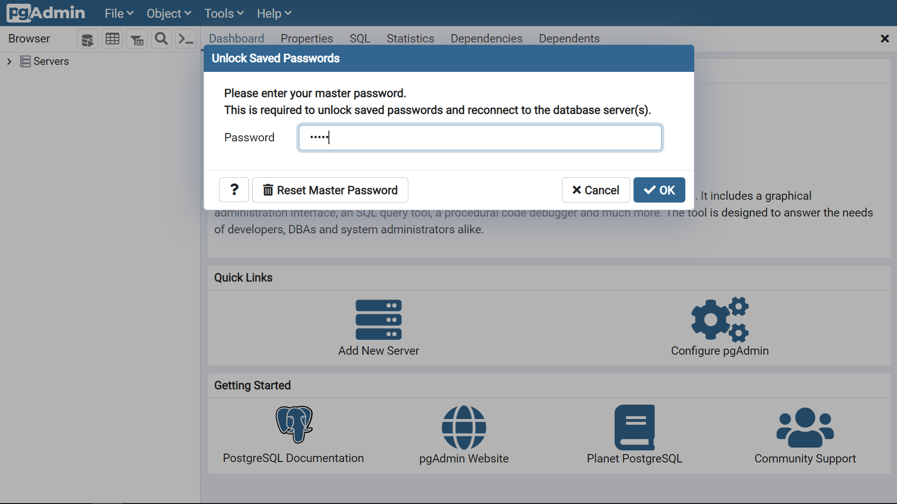
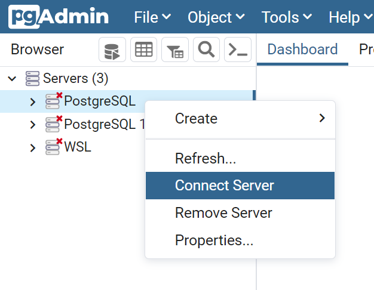
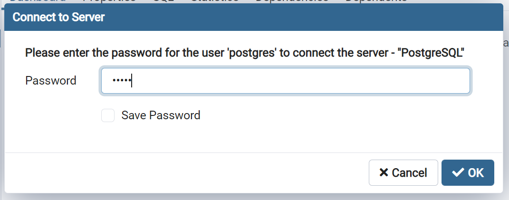
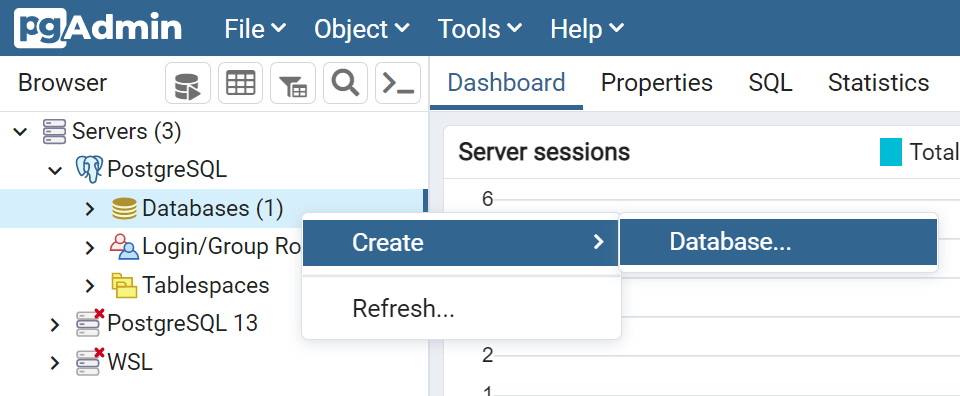
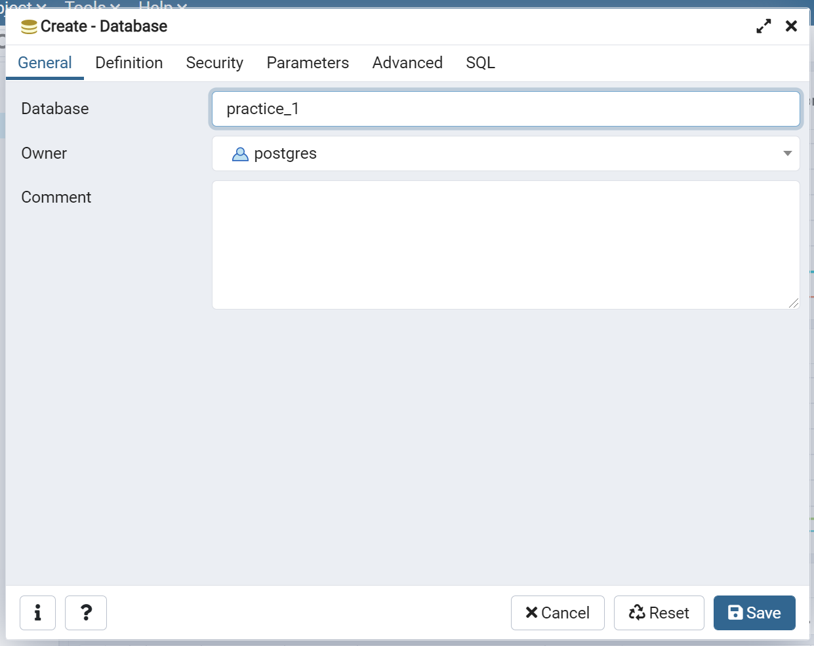
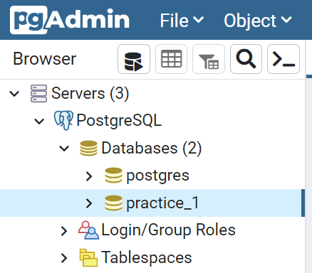
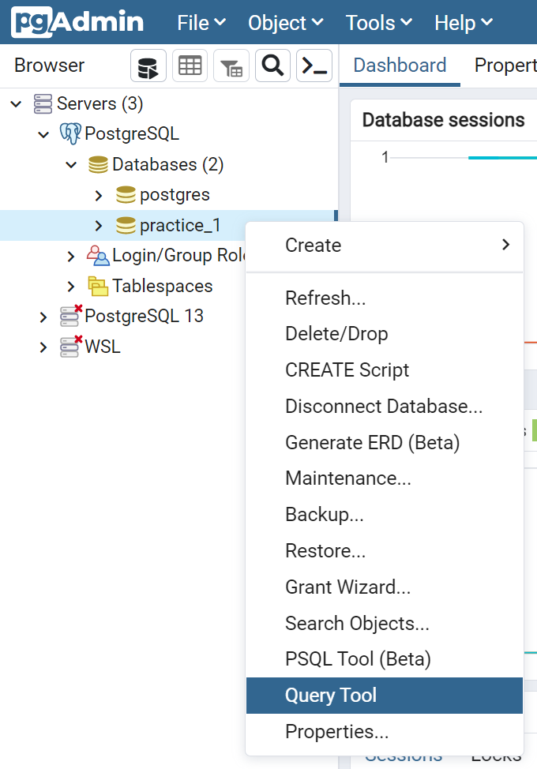
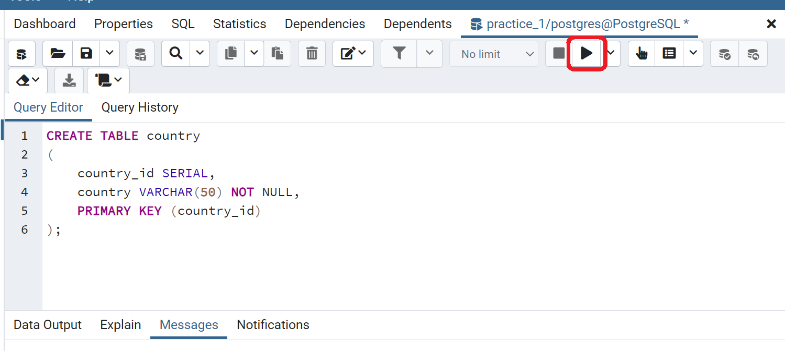
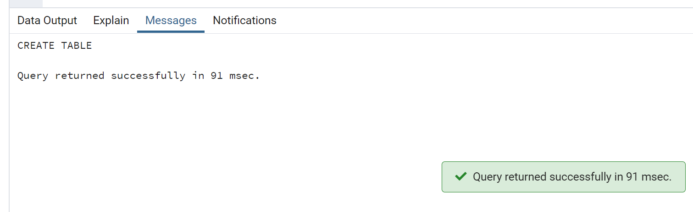
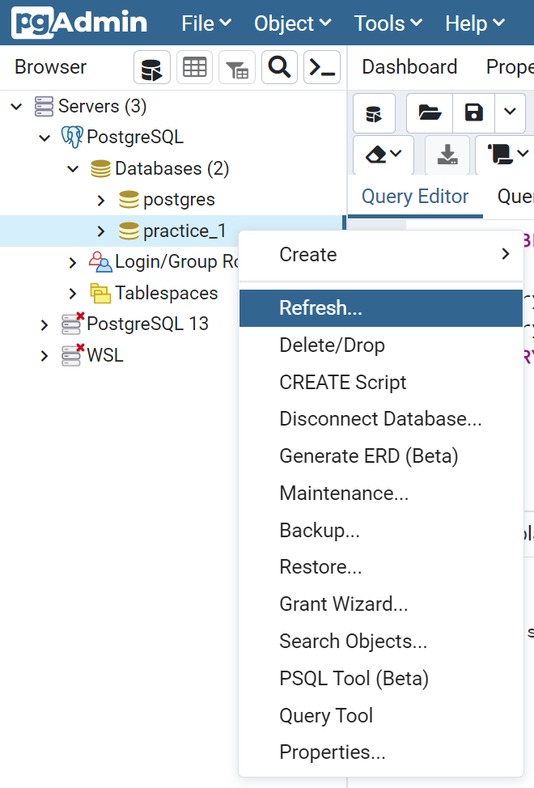

# PostgreSQL Database
This hands-on guide will teach you how to create a new database and the SQL table which will be used for upcoming hands-on practices.

- [PostgreSQL Database](#postgresql-database)
  - [1.0 Creating database using psql](#10-creating-database-using-psql)
    - [1.1: Run psql](#11-run-psql)
    - [1.2: Create a database](#12-create-a-database)
    - [1.3: List available databases](#13-list-available-databases)
    - [1.4: Switch database connection](#14-switch-database-connection)
    - [1.5: Reconnect database](#15-reconnect-database)
  - [2.0 Creating database using pgAdmin](#20-creating-database-using-pgadmin)
    - [2.1: Run pgAdmin 4](#21-run-pgadmin-4)
    - [2.2: Connect to local database server](#22-connect-to-local-database-server)
    - [2.3: Create a database](#23-create-a-database)
  - [3.0 Creating table in SQL](#30-creating-table-in-sql)
    - [3.1: Run SQL Statement](#31-run-sql-statement)
    - [3.2: List available tables](#32-list-available-tables)
  - [4.0 Creating table in pgAdmin](#40-creating-table-in-pgadmin)
    - [4.1: Run SQL using Query Tool](#41-run-sql-using-query-tool)
    - [4.1: Check tables](#41-check-tables)

## 1.0 Creating database using psql
### 1.1: Run psql

Run the command below and enter the password for the `postgres` database user if prompts.

**Windows command:**
```console
psql -d postgres -U postgres -W
```

**Ubuntu command:**
```console
sudo -u postgres psql
```

**Example output:**
```console
D:\>psql -d postgres -U postgres -W
Password:
psql (13.4)
WARNING: Console code page (437) differs from Windows code page (1252)
         8-bit characters might not work correctly. See psql reference
         page "Notes for Windows users" for details.
SSL connection (protocol: TLSv1.3, cipher: TLS_AES_256_GCM_SHA384, bits: 256, compression: off)
Type "help" for help.

postgres=#
```

`postgres=#` indicates that you are connected to the default database which is the `postgres` database.

For Windows users, you can ignore the WARNING message displayed here. If you want to resolve this WARNING, you can run `chcp 1252` before running psql.

**Solution:**
```console
C:\WINDOWS\system32>chcp 1252
Active code page: 1252

C:\WINDOWS\system32>psql -d postgres -U postgres -W
Password:
psql (13.4)
SSL connection (protocol: TLSv1.3, cipher: TLS_AES_256_GCM_SHA384, bits: 256, compression: off)
Type "help" for help.

postgres=#
```

### 1.2: Create a database

Use the SQL statement below to create a new database with the name `practice_1`.

**SQL:**
```SQL
CREATE DATABASE practice_1;
```

**Example output:**
```console
postgres=# CREATE DATABASE practice_1;
CREATE DATABASE
```

### 1.3: List available databases

You can run the command below in psql to show all the available databases in your PostgreSQL.

**psql Command:**
```console
\l
```

**Example output:**
```console
postgres=# \l
                              List of databases
    Name    |  Owner   | Encoding | Collate |  Ctype  |   Access privileges
------------+----------+----------+---------+---------+-----------------------
 postgres   | postgres | UTF8     | C.UTF-8 | C.UTF-8 |
 practice_1 | postgres | UTF8     | C.UTF-8 | C.UTF-8 |
 template0  | postgres | UTF8     | C.UTF-8 | C.UTF-8 | =c/postgres          +
            |          |          |         |         | postgres=CTc/postgres
 template1  | postgres | UTF8     | C.UTF-8 | C.UTF-8 | =c/postgres          +
            |          |          |         |         | postgres=CTc/postgres
(4 rows)
```

`\l` is not a SQL statement here, it is one of the meta-commands that can be used in psql.

You will see the newly created database named `practice_1` if you successfully run the previous create database SQL statement. There are also 3 more existing databases that have been created beforehand. 

`postgres`: A default database meant for use by users, utilities and third-party applications. Any connection without specifying other databases will automatically connect to this database.

`template1`: A template database that will be used to create another new database. When creating a new database, the inner structure of `template1` will be copied to that new database.

`template0`: A backup template database that is used to restore the `template1` database if damaged or altered.


### 1.4: Switch database connection

Now you will use the command below to switch the connection to the new `practice_1` database created previously.

**psql Command:**
```console
\c practice_1
```

**Example output:**
```console
postgres=#  \c practice_1
Password:
SSL connection (protocol: TLSv1.3, cipher: TLS_AES_256_GCM_SHA384, bits: 256, compression: off)
You are now connected to database "practice_1" as user "postgres".
practice_1=#
```

`practice_1=#` terminal prompt indicates that you are currently connected to the `practice_1` database.

### 1.5: Reconnect database

Next time when you want to reconnect to the created database in psql, you can use the command below.

**psql Command:**
```console
psql -d practice_1 -U postgres -W
```

**Example output:**
```console
D:\>psql -d practice_1 -U postgres -W
Password:
psql (13.4)
Type "help" for help.

practice_1=#
```


## 2.0 Creating database using pgAdmin

### 2.1: Run pgAdmin 4

When your pgAdmin 4 is running, it will prompt you to enter the master password. Enter the master password you have set during the installation guide. If you forgot the master password, you can click `Reset Master Password` to reset, but all the existing database connections will be erased (do not worry about it as you do not have any connection right now).



### 2.2: Connect to local database server

If you have not connected to any local database server or the database server connection record has been erased, please refer to the steps from the Installation guide [here](Installation.md#43-pgadmin-4-desktop-app-windows-or-ubuntu) to learn how to initiate the connection.

To reconnect the disconnected database server connection, just right click the `PostgreSQL` list item under the `Server` section and select `Connect Server`.



Then enter the `postgres` user password and click `OK` to reconnect the server.



### 2.3: Create a database

After the server connection is established, you can see one default database called `postgres` is been created for you automatically. In this hands-on tutorial, we will be using another new database instead of this default one.

To create a new database, right click `Databases (1)` list item and select `Create` > `Database...`.



Enter `practice_1` in the `Database` field to give this new database a name. Then click the `Save` button.



After that, you will see a new item list called `practice_1` under the `Databases (2)` list. This indicates that you have created a new database and connected it to this database.



## 3.0 Creating table in SQL

### 3.1: Run SQL Statement

Paste the SQL statement below in the psql terminal and hit `Enter`. This SQL statement will create a SQL table in the `practice_1` database.

**SQL:**
```SQL
CREATE TABLE country
(
    country_id SERIAL,
    country VARCHAR(50) NOT NULL,
    PRIMARY KEY (country_id)
);
```

**Example output:**
```console
practice_1=# CREATE TABLE country
practice_1-# (
practice_1(#     country_id SERIAL,
practice_1(#     country VARCHAR(50) NOT NULL,
practice_1(#     PRIMARY KEY (country_id)
practice_1(# );
CREATE TABLE
```

You can run any SQL statement using psql. Remember to put `;` (semicolon) at the end of each SQL statement.

> Semicolon is the standard way to separate each SQL statement in database systems that allow more than one SQL statement to be executed in the same call to the server.

### 3.2: List available tables

To verify or check existing tables, you can use the command below in psql. It will list out all the available tables created in this database.

**psql Command:**
```Console
\dt
```

**Example output:**
```console
practice_1=# \dt
          List of relations
 Schema |  Name   | Type  |  Owner
--------+---------+-------+----------
 public | country | table | postgres
(1 row)
```

From the output result, you can see that the `country` table is created by the `postgres` user (the default database user you are using).

## 4.0 Creating table in pgAdmin

### 4.1: Run SQL using Query Tool

Go to `PostgreSQL` > `Databases (2)` > `practice_1`. Right click the `practice_1` and click `Query Tool`. A Query Editor will be shown on your right.



Paste the SQL statement below and click the `▶` button on the top right (or press `F5`) to execute the SQL statement. This SQL statement will create a SQL table in the `practice_1` database.

**SQL:**
```SQL
CREATE TABLE country
(
    country_id SERIAL,
    country VARCHAR(50) NOT NULL,
    PRIMARY KEY (country_id)
);
```




You will receive the output as below if the table is successfully created.



The Query Tool is a powerful, feature-rich environment that allows you to execute arbitrary SQL commands and review the result set. Query Editor is one of the Query Tool features that provides autocomplete and syntax highlight to SQL editing that psql does not have.

You can go to the official documentation [here](https://www.pgadmin.org/docs/pgadmin4/5.2/query_tool.html) to learn more about the Query Tool.

### 4.1: Check tables

To check all the existing tables in the `practice_1` database, you need to refresh the database.
To do this, just right click `practice_1` in the Browser pane and click `Refresh...`.



After that, go to click `practice_1` > `Schemas (1)` > `Tables (1)`. It will list the `country` table you created just now.

