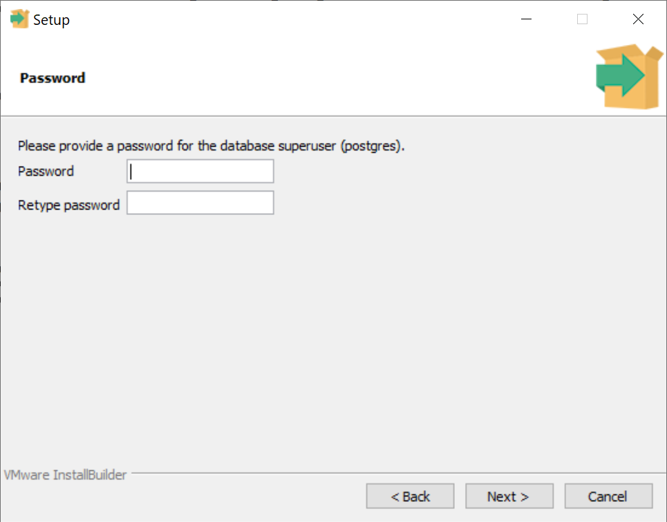
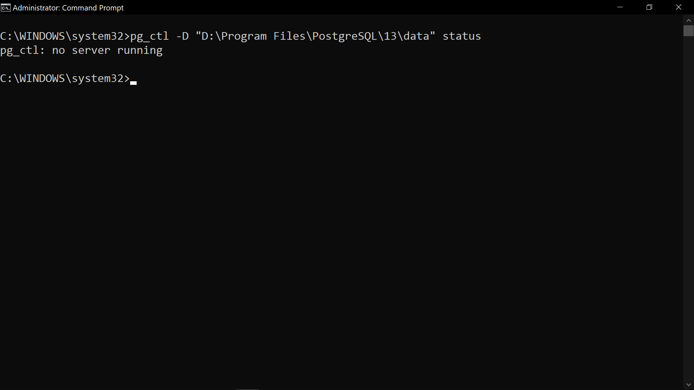

# PostgreSQL Installation
This guide will show the installation flow for PostgreSQL Version 13.4. You can install PostgreSQL on Linux (Ubuntu), Windows 10 or Windows 10 WSL.

- [PostgreSQL Installation](#postgresql-installation)
  - [1.0 Minimum System Requirements](#10-minimum-system-requirements)
    - [1.1 Windows 10 (64-bit)](#11-windows-10-64-bit)
    - [1.2 Ubuntu](#12-ubuntu)
  - [2.0 Installing PostgreSQL (**Windows**)](#20-installing-postgresql-windows)
    - [2.1 Download Installer](#21-download-installer)
    - [2.2 Run Installer](#22-run-installer)
    - [2.3 Add path to PATH environment variable](#23-add-path-to-path-environment-variable)
  - [3.0 Installing PostgreSQL (**Ubuntu** or **WSL**)](#30-installing-postgresql-ubuntu-or-wsl)
    - [3.1 Install PostgreSQL](#31-install-postgresql)
    - [3.2 Set Password for `postgres` user](#32-set-password-for-postgres-user)
  - [4.0 Connect to PostgreSQL local database server](#40-connect-to-postgresql-local-database-server)
    - [4.1 Using SQL Shell (**Windows**)](#41-using-sql-shell-windows)
    - [4.2 Using Terminal](#42-using-terminal)
      - [**Windows**](#windows)
      - [**Ubuntu** or **WSL**](#ubuntu-or-wsl)
  - [5.0 Others](#50-others)
    - [5.1 Change `postgres` database user password](#51-change-postgres-database-user-password)
  - [Tested on](#tested-on)
  - [References](#references)

## 1.0 Minimum System Requirements
### 1.1 Windows 10 (64-bit)
- 1 GHz processor
- 512MB Harddisk space
- 4GB Ram

### 1.2 Ubuntu
- 1 GHz processor
- 512MB Harddisk space
- 2GB Ram

## 2.0 Installing PostgreSQL (**Windows**)
### 2.1 Download Installer
Go to official download site [here](https://www.postgresql.org/download/).

Step 1: Click "Windows"


Step 2: Click "Download the installer".


Step 3: Select "Windows x86-64" with version 13.4. The download will start automatically.


### 2.2 Run Installer
Once the download has finished, run the installer.

Step 1: Click `Next`


Step 2: You can change your `Installation Directory` here. Click `Next` to confirm it.

Note: Please note the installation path you have chosen as you will need to manually add the path in system environment variables later.


Step 3: Make sure all the options are checked. Click `Next` to proceed.


Step 4: Make sure that the `Data Directory` is a subdirectory of the `Installation Directory`. Click `Next`.


Step 5: Provide a password for the default database user. The username of this user will be `postgres`.
The password can be changed later, you can use `admin` as your password temporally for convenience.



Step 6: By default the `Port` will be `5432`, click `Next`.


Step 7: Set the `Locale` to `English, Malaysia`


Step 8: You can check the installation settings here. Click `Next` to start the installation.


Step 9: Click `Next` to confirm.


Step 10: Wait for the installation to complete. It will take around 10 minutes depending on your computer hardware.


Step 11: Uncheck the `Launch Stack Builder at exit?`. No extra tools need to be installed for this course. Click `Finish` to close the program.


### 2.3 Add path to PATH environment variable
The purpose of doing this is to enable PostgreSQL command running on Windows Command Prompt or other terminal applications.

Step 1: Search "Edit the system environment variables" in the Windows start menu and click `Edit the system environment variables`.


Step 2: Click `Environment Variables...`


Step 3: Under `User variables for...`, double click `Path` variable.


Step 4: To insert a value, click `New`. You need to add the following values (replace with the PostgreSQL installation directory noted early):
- `<Installation Directory>\bin`
- `<Installation Directory>\lib`

Example in this installation case:
- `C:\Program Files\PostgreSQL\13\bin`
- `C:\Program Files\PostgreSQL\13\lib`


Step 5: After adding the values, close all the windows by clicking `OK`. Then restart your computer.

Step 6: To make sure the PostgreSQL is installed correctly, go to `Start Menu`, search for `SQL Shell (psql)` and run it.


Shell terminal will display as below.


## 3.0 Installing PostgreSQL (**Ubuntu** or **WSL**)
### 3.1 Install PostgreSQL
Step 1: Create the file repository configuration
```sh
sudo sh -c 'echo "deb http://apt.postgresql.org/pub/repos/apt $(lsb_release -cs)-pgdg main" > /etc/apt/sources.list.d/pgdg.list'
```

Step 2: Import the repository signing key
```sh
wget --quiet -O - https://www.postgresql.org/media/keys/ACCC4CF8.asc | sudo apt-key add -
```

Step 3: Update the package lists
```sh
sudo apt-get update
```

Step 4: Install the PostgreSQL version 13
```sh
sudo apt-get -y install postgresql-13
```

Example outputs:


### 3.2 Set Password for `postgres` user
By default, a `postgres` normal user will be created automatically after installing PostgreSQL in the Linux system. A password must be set for this user to connect to the default database.

Step 1: Paste this command and enter a new password when prompt.
```sh
sudo passwd postgres
```


Step 2: Start postgresql service.
```console
sudo service postgresql start
```


Step 3: Switch to `postgres` system user, enter the password when prompt.
```console
su postgres
```


Step 4: Run psql
```console
psql
```


Step 5: Use the command below to insert a new password (use the same password as Step 1).
```console
\password
```


Step 6: Quit the PostgreSQL connection.
```console
\q
```

## 4.0 Connect to PostgreSQL local database server
This guide will show you how to connect to the database server in different methods.

Before connecting to the local database server, you need to make sure that the PostgreSQL service is running.

Step 1: Check service status.

**Windows**

Replace `<Data Directory>` with the Data Directory path set during the installation.
```console
pg_ctl -D <Data Directory> status
```

Example in this installation case:
```console
pg_ctl -D "C:\Program Files\PostgreSQL\13\data" status
```

**Ubuntu** or **WSL**
```console
sudo service postgresql status
```

Step 2: If the service is not running or inactive, start the service using the command below, else skip this step




**Windows**

Replace `<Data Directory>` with the Data Directory path set during the installation.
```console
pg_ctl -D <Data Directory> start
```

Example in this installation case:
```console
pg_ctl -D "C:\Program Files\PostgreSQL\13\data" start
```

**Ubuntu** or **WSL**
```console
sudo service postgresql start
```

### 4.1 Using SQL Shell (**Windows**)
Step 1: Run the SQL Shell


Step 2: Hit enter to use the default values for the prompts. When it prompts "Password for user postgres", use the password you have set during the installation.


### 4.2 Using Terminal
#### **Windows**
Step 1: Use the command below.
```console
psql -d <database-name> -U <username> -W
```
Example in this installation case:
```console
psql -d postgres -U postgres -W
```
Then enter the password you have set just now.


#### **Ubuntu** or **WSL**
Step 1: Use the commands below and enter the password you have set previously.

```console
su postgres
psql
```


## 5.0 Others
### 5.1 Change `postgres` database user password
Step 1: Login into psql.
```console
psql -d postgres -U postgres -W
```
```console
sudo -u postgres psql
```

Step 2: Use this command to set a new password. Replace `<username>` with the username you want.
```console
\password <username>
```
Example:
```console
\password postgres
```

## Tested on
- Microsoft Windows 10 Pro 10.0.19042 Build 19042
- Ubuntu 20.04.3 LTS

## References
- [Linux downloads (Ubuntu)](https://www.postgresql.org/download/linux/ubuntu/)
- [Install PostgreSQL on WSL](https://docs.microsoft.com/en-us/windows/wsl/tutorials/wsl-database#install-postgresql)
- [WSL commands and launch configurations](https://docs.microsoft.com/en-us/windows/wsl/wsl-config)

